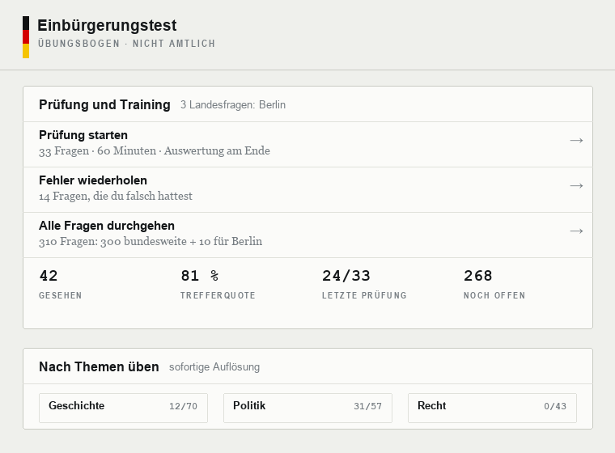
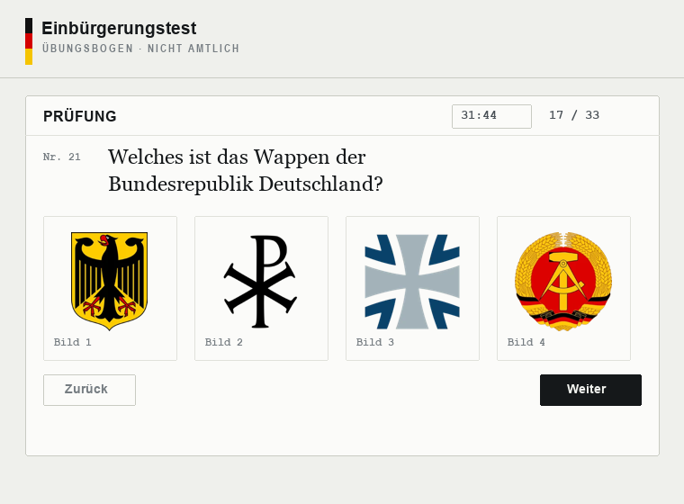
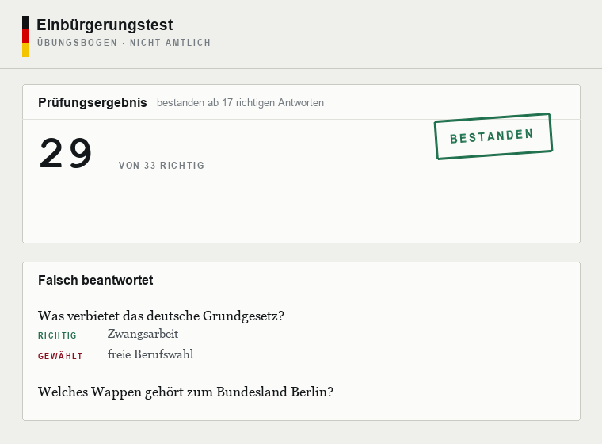

<div align="center">

# E I N B Ü R G E R U N G S T E S T

**Alle 460 Fragen des amtlichen Katalogs — in einer Datei, die nichts weiter braucht.**

<sub>D e s i g n e d&nbsp;&nbsp;b y&nbsp;&nbsp;S e r g i o</sub>

<br>


<br>


<br><br>





<sub>Start · Prüfung, Fehler, Themen&nbsp;&nbsp;·&nbsp;&nbsp;Bildfragen mit den Wappen des Katalogs&nbsp;&nbsp;·&nbsp;&nbsp;Ergebnis · jeder Fehler mit richtiger Antwort</sub>

<br>

[](https://themaestr-o.github.io/einbuergerungstest/)
&nbsp;&nbsp;
[](https://github.com/TheMaestr-o/einbuergerungstest/raw/main/index.html)

<sub>im Browser öffnen · oder die Datei laden und offline behalten</sub>

</div>

<br>

## Was es tut

Der **Einbürgerungstest** — die 33 Fragen zu Recht, Geschichte und Gesellschaft, die für die Einbürgerung zu bestehen sind — als **eine HTML-Datei zum Doppelklicken**.

Keine Installation, kein Server, kein Konto, kein Netz. Fragen, Antworten, alle 100 Bilder und die Schriften stecken in der Datei. Auf einen USB-Stick legen, sich selbst mailen, im Flugmodus auf dem Telefon öffnen: es läuft.

Enthalten sind alle **300 bundesweiten** und **160 landesspezifischen** Fragen des amtlichen Katalogs vom **7. Mai 2025** — im Wortlaut und in der Reihenfolge, in der sie in der Prüfung stehen.

<br>

## Funktionen

| Funktion | Was sie tut |
|---|---|
| **Prüfung** | 33 Fragen wie im Ernstfall: 30 bundesweite plus 3 aus dem gewählten Bundesland, 60 Minuten, keine Auflösung vor der Abgabe. Bestanden ab 17 |
| **Training** | Zehn Themen oder die zehn Fragen des eigenen Landes, jede Antwort löst sich sofort auf |
| **Fehlerspeicher** | Was falsch war und was noch nie dran war, kommt häufiger — der Durchgang gewichtet sich selbst |
| **Bildfragen** | Wappen, Flaggen, Landkarten, Stimmzettel: alle 100 Bilder des Katalogs, als anklickbare Antworten |
| **Auswertung** | Jeder Fehler mit der richtigen Antwort und der eigenen Wahl daneben; ein Klick übt genau diese Fragen nach |
| **Fortschritt** | Gesehene Fragen, Trefferquote, frühere Prüfungen — im Browser gespeichert, nichts wird hochgeladen |
| **Tastatur** | `1`–`4` antworten, `Enter` weiter; die Fortschrittsleiste springt zu jeder Frage |
| **Telefon** | Das Layout klappt um, Antwortflächen werden zu Tippzielen, die Notch bleibt frei |
| **Hell und dunkel** | Folgt dem System, lässt sich mit einem Klick umstellen |

<br>

## Woher die Antworten kommen

Der amtliche Katalog ist ein [PDF mit 191 Seiten][bamf]. Es enthält jede Frage und jede Option — und **keine Lösungen**: die Kästchen davor sind alle leer.

Die richtigen Antworten stammen deshalb aus zwei unabhängigen offenen Datensätzen, **gegeneinander geprüft**:

| Quelle | Beitrag |
| --- | --- |
| [BAMF-Gesamtfragenkatalog (PDF)][bamf] | maßgeblicher Wortlaut von Frage und Optionen |
| [flexsurfer/einburgerungstest][s1] | Lösung, Themenzuordnung |
| [leben-in-deutschland-scrapper][s2] | Lösung |

Verglichen wird der **Text** der richtigen Antwort, nie ihre Position — beide Datensätze ordnen die Optionen anders als das PDF. Das Ergebnis:

- **457 Fragen** — beide Quellen nennen dieselbe Antwort.
- **3 Fragen** — *Was verbietet das deutsche Grundgesetz?* sowie die Landeshauptstädte von Brandenburg und Hessen — haben in Quelle 2 ein leeres Lösungsfeld, es zählt Quelle 1.
- **1 Frage** — das Wappen der DDR — ist ein echter Widerspruch. Entschieden am Bild im PDF: Hammer, Zirkel und Ährenkranz ist **Bild 4**. Der Datensatz mit Bild 2 lag falsch.
- **37 Fragen wurden zusätzlich am Bild selbst nachgeprüft**, weil die Nummerierung „Bild 1–4“ je nach Quelle anders ausfällt: 19 Wappen und Flaggen, 16 Landkarten, der Stimmzettel und die Besatzungszonen. 36 bestätigten die Datensätze, eine korrigierte sie.

Eine Eigenheit bleibt bewusst stehen: In Frage 201 schreibt das amtliche PDF bei einer *falschen* Option „Niedersachen“ statt „Niedersachsen“. Der Tippfehler ist nicht korrigiert — der Text folgt dem Original.

<br>

## Selbst bauen

```bash
python3 -m venv .venv && ./.venv/bin/pip install pypdf pillow
python3 build/fetch_fonts.py     # einmalig: Schriften als data:-URIs, damit die Datei kein Netz braucht
python3 build/build_html.py      # data/ + build/app.template.html  ->  index.html
```

| Datei | Inhalt |
|---|---|
| `index.html` | der fertige Trainer, alles eingebettet |
| `data/questions.json` | 460 Fragen mit Lösung, Thema und Bildern |
| `data/images/` | 100 WebP-Bilder aus dem PDF |
| `build/app.template.html` | die App selbst, mit Platzhaltern für Daten und Bilder |
| `tools/` | die Aufbereitung: PDF-Text mit Koordinaten lesen, in Aufgaben zerlegen, die Trennfehler des PDFs reparieren, Lösungen abgleichen, jedes Bild über seine Position auf der Seite der richtigen Frage zuordnen |

<br>

## Rechtliches

Ein **privates, nicht-kommerzielles Projekt**. Keine Werbung, keine Einnahmen, keine Anmeldung, keine Statistik, keine Datenerhebung — die Seite hat keinen eigenen Server, an den sie etwas senden könnte, und was sie sich merkt, bleibt im Browser.

Die Fragen, Optionen und Bilder sind **nicht von mir**. Sie werden unverändert aus dem [Gesamtfragenkatalog des BAMF][bamf] (Stand 07.05.2025) wiedergegeben — einem amtlichen Werk, das im amtlichen Interesse zur allgemeinen Kenntnisnahme veröffentlicht wurde (§ 5 Abs. 2 UrhG), mit Quellenangabe und ohne Änderung des Wortlauts (§§ 62, 63 UrhG). Die gezeigten Wappen, Flaggen und Karten sind Teil dieses Katalogs und stehen hier nur als dessen Wiedergabe — nicht als Hoheitszeichen und nicht als Hinweis auf eine amtliche Stelle.

Dieses Projekt steht in **keiner Verbindung zum BAMF** oder einer anderen Behörde, ist von keiner beauftragt, geprüft oder unterstützt und ist **kein amtliches Angebot und keine offizielle Prüfungsvorbereitung**. Keine Gewähr für Richtigkeit und Aktualität: maßgeblich ist allein der jeweils gültige amtliche Fragenkatalog. Der Code steht unter der MIT-Lizenz, das amtliche Material nicht.

Datenschutzerklärung und Haftungsausschluss stehen vollständig **in der Seite selbst**, unter *Rechtliches* — damit sie auch offline da sind.

[bamf]: https://www.bamf.de/SharedDocs/Anlagen/DE/Integration/Einbuergerung/gesamtfragenkatalog-lebenindeutschland.html
[s1]: https://github.com/flexsurfer/einburgerungstest
[s2]: https://github.com/leben-in-deutschland/leben-in-deutschland-scrapper
