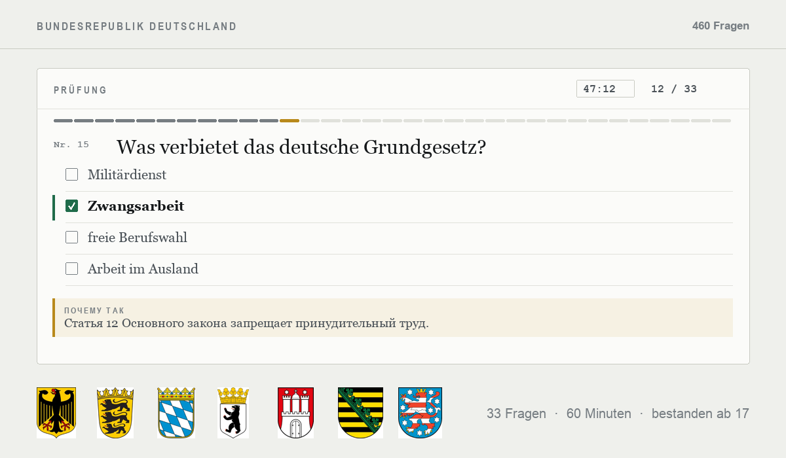

<div align="center">

# E I N B Ü R G E R U N G S T E S T

**All 460 questions of the German naturalisation test — in one file that needs nothing.**

<sub>Built from the official BAMF question catalogue, answers verified against the source</sub>

<br>


<br>



<br><br>

### [**▶&nbsp; Open the trainer**](https://themaestr-o.github.io/einbuergerungstest/)

</div>

<br>

## What it is

The **Einbürgerungstest** — the 33-question test on German law, history and society you have to pass for citizenship — as **one HTML file you can double-click**.

No installation, no server, no account, no network. Questions, answers, all 100 pictures and the fonts are inside the file. Put it on a USB stick, mail it to yourself, open it on a phone in flight mode: it works.

All **300 nationwide** and **160 state-specific** questions from the official catalogue of the [Federal Office for Migration and Refugees][bamf], as published on **7 May 2025**. The wording and the order of the options are the ones you will see in the exam.

<br>

## Two ways to work with it

| | |
|---|---|
| **Prüfung** | The real thing: 33 questions — 30 nationwide plus 3 from your federal state — a 60-minute clock, no feedback until you hand it in. Pass mark 17. The result screen lists every question you got wrong, with the right answer and why it is right. |
| **Training** | Ten topics, or the ten questions of your state. Each answer resolves immediately and explains itself. Questions you got wrong and questions you have never seen come back more often. |

Your progress lives in the browser: which questions you have seen, which ones you keep failing, the state you picked, past exam scores. Nothing is uploaded anywhere — and nothing to log in to.

Keyboard on a desktop: `1`–`4` to answer, `Enter` for the next question. On a phone the layout reflows and the answer rows grow into proper tap targets.

<br>

## Where the answers come from

The official catalogue is a [191-page PDF][bamf]. It contains every question and every option — and **no answers**: the little boxes in front of the options are all empty.

So the correct answers come from two independent open datasets, **checked against each other**:

| Source | What it contributes |
|---|---|
| [BAMF question catalogue (PDF)][bamf] | the authoritative wording of every question and option |
| [flexsurfer/einburgerungstest][s1] | answer key, topic grouping |
| [leben-in-deutschland-scrapper][s2] | answer key |

The comparison runs on the **text** of the correct answer, never on its position — both datasets order the options differently from the PDF. The outcome:

- **457 questions** — both sources name the same answer.
- **3 questions** — *Was verbietet das deutsche Grundgesetz?* and the capitals of Brandenburg and Hessen — have an empty answer field in the second source, so the first one decides.
- **1 question** — the coat of arms of the GDR — is a genuine conflict. Settled by looking at the artwork in the PDF: hammer, compass and wreath of rye is **picture 4**. The dataset that said picture 2 was wrong.
- **37 questions were additionally verified against the pictures themselves**, because the numbering "picture 1–4" can differ between sources: 19 coats of arms and flags, 16 maps (*Welches Bundesland ist …?*), the ballot paper and the occupation zones. 36 confirmed the datasets, one corrected them.

One deliberate oddity: in question 201 the official PDF misspells "Niedersachsen" as "Niedersachen" — in a *wrong* option. The typo is kept. The text follows the original.

<br>

## Learning, not just drilling

Every one of the 460 questions carries a one-sentence explanation in Russian of **why that answer is the right one**, with the German term kept where it is worth memorising:

> **Was verbietet das deutsche Grundgesetz?**
> Статья 12 Основного закона запрещает принудительный труд (Zwangsarbeit).

The machine-written "explanations" that ship with the second dataset were not usable: 228 of 458 are the placeholder *«Важный вопрос для жизни в Германии»*, and the rest paraphrase the topic instead of justifying the answer. These were written from scratch. The 160 state questions follow ten fixed patterns and are generated per state from one table.

Behind the one-liners sit **eleven background essays in Russian**, one per storyline the catalogue keeps circling: the Basic Law, who elects whom, how the two votes work, 1933–1945, the Shoah and the responsibility towards Israel, the occupation zones, the GDR and the Wall, the European Union, the welfare system, courts and lay judges, everyday life and equal treatment. **275 of the 300 nationwide questions link to the essay they belong to** — read one storyline and dozens of questions answer themselves. They are also browsable on their own, like a small textbook.

The Russian layer can be switched off entirely under *Einstellungen → Русские подсказки*; the app then runs in German only.

<br>

## Building it

```bash
python3 -m venv .venv && ./.venv/bin/pip install pypdf pillow
python3 build/fetch_fonts.py     # once: fonts as data: URIs, so the file needs no network
python3 build/build_html.py      # data/ + build/app.template.html  ->  index.html
```

| | |
|---|---|
| `index.html` | the finished trainer, everything embedded |
| `data/questions.json` | 460 questions with answer, topic, images, explanation |
| `data/images/` | 100 WebP pictures extracted from the PDF |
| `build/app.template.html` | the app itself, with `__DATA__` / `__IMAGES__` placeholders |
| `tools/` | the pipeline: read the PDF text with coordinates, split it into questions, repair the PDF's broken word spacing, reconcile the answer keys, map each image to its question by position on the page |

<br>

## Legal

A **private, non-commercial project**. No ads, no revenue, no registration, no tracking, no data collection — the page has no server of its own to send anything to, and everything it remembers stays in your browser.

The questions, options and images are **not mine**. They are reproduced unchanged from the [BAMF question catalogue][bamf] (7 May 2025), an official work published for general knowledge (§ 5 (2) UrhG), with the source named and the wording untouched (§§ 62, 63 UrhG). The coats of arms, flags and maps are shown only as part of that catalogue — not as state emblems and not as a sign of any official body.

This project is **not affiliated with the BAMF** or any authority, is not commissioned, reviewed or endorsed by one, and is **not official exam preparation**. No warranty for correctness or currency: the valid official catalogue is what counts. The code is MIT; the official material is not.

The full privacy notice and disclaimer are inside the page itself, under **Rechtliches** — so they are there offline too.

[bamf]: https://www.bamf.de/SharedDocs/Anlagen/DE/Integration/Einbuergerung/gesamtfragenkatalog-lebenindeutschland.html
[s1]: https://github.com/flexsurfer/einburgerungstest
[s2]: https://github.com/leben-in-deutschland/leben-in-deutschland-scrapper
